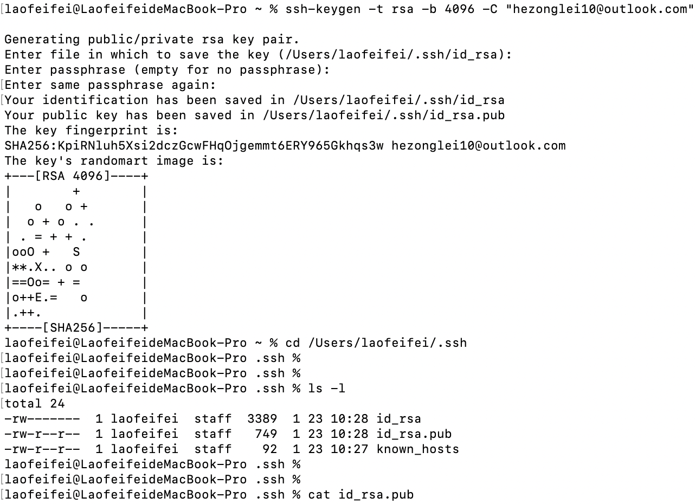

## 前提

本次是对平时经常使用的一些git指令进行总结，方便后续遗忘时进行查阅。本次以mac环境为例

<!--more-->

## 正文

### 一、Git配置SSH公钥

使用https连接github可能因为网络原因出现连接不上，并且可能需要经常输入密码，这里可尝试使用SSH来连接Github。

1.步骤一：

```
ssh-keygen -t rsa -b 4096 -C "your@example.com"
```

2.步骤二



如上图操作：输入命令后可更改文件名及路径，一般默认即可，记住生成的文件路径。之后会让设置密码，不设置可直接回车，之后打开后缀为pub的文件，复制里面的全部内容并在github的设置中进行配置即可

**注意：**一定要复制文件里的全部内容，不然无法被Github识别到

### 二、Git常用指令

初始化：git init

配置信息：

```
git config  user.name "youname"
git config  user.email "your@example"
```

如需全局配置，使用git config --globa luser.name"username"，邮箱类似。

连接远程仓库：git remote add origin 仓库地址连接

添加文件：git add .

提交仓库：git commit -m "自定义名字"

创建分支：git branch 分支名字

切换分支：git checkout 分支名字

推送远程仓库：git push origin 分支名字

拉取远程仓库合并：git pull origin 分支名字

合并分支：git merge 分支名字

删除分支：git branch -d 分支名字

版本回退：git reset --hard 版本号(可利用git log命令查看
